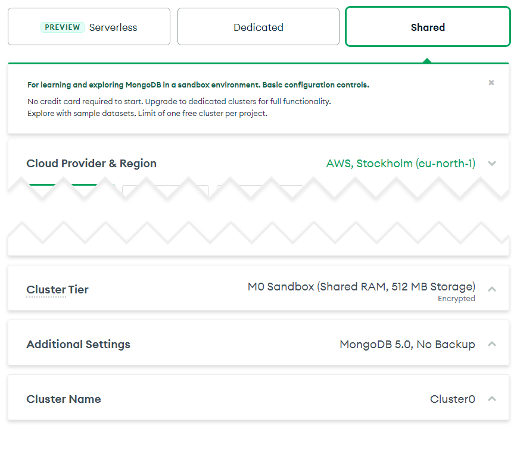

If you're anything like me, you have a number of small open-source projects that you've released onto the world. Seeing those projects being used by others is a big driving force - but for projects that are simply websites, tracking whether or not anyone is actually using them is non-trivial.

You could always throw a Google Analytics script on them, but selling out the privacy of your users for the sake of analytics doesn't sit well with me. Being the kind of person who cares about online privacy, the thought of sending user data off to Big Corp™ just isn't that appealing - not to mention the issue of GDPR and cookie consent.

Luckily a number of open-source solutions have started popping up for privacy-aware analytics. One of them is called [Ackee](https://github.com/electerious/Ackee). In this article I'll walk you through setting up Ackee using only free and managed hosting solutions. This will let you get up and running quickly, without needing to rent a VPS or similar.

## Getting Started

Head on over to [the Ackee repo](https://github.com/electerious/Ackee#readme) and have a look around. They have guides for a number of different hosting providers (or hosting on your own machine using Docker), but for the sake of the article we'll be choosing to host on [Vercel](https://github.com/electerious/Ackee/blob/master/docs/Get%20started.md#with-vercel). Vercel lets us host the backend as a serverless function, as well as the analytics frontend, entirely for free.

Vercel doesn't host databases though. For that, we'll need to find a MongoDB server provider. Luckily [MongoDB Atlas](https://www.mongodb.com/atlas/database), the managed cloud solution from MongoDB themselves, has a free tier! This means we can host not only Ackee itself, but also the database we use to store our content without having to pull our credit card out of our pockets.

So the plan right now is:

1. Set up a MongoDB database using the free tier of MongoDB Atlas. This is somewhat limited in how much data can be stored (up to 512MB) - but is great for getting started quickly, and can easily be upgraded if needed.
2. Set up a Vercel project to host the Ackee frontend and GraphQL backend. Their generous personal hobby plan allows us to run serverless functions and host static frontends for free, as long as we don't exceed our quota.

## Hosting the database

Thanks to MongoDB Atlas, getting our database set up takes a matter of minutes. Start by heading to [their pricing page](https://www.mongodb.com/pricing) and selecting "Try for Free" on their shared plan. The first thing you should see after creating an account is the cluster creation screen.

There aren't any critical settings to choose here; pick whichever location you like the most (although keeping it close to your Vercel location helps performance), and set a memorable cluster name.

When it comes to choosing the authentication method you'll want to choose a username you can remember and a randomly generated password. It's important that this password is secure, as we'll be connecting to the database from Vercel - meaning we don't know what IP we'll be connecting from. This means the username and password are the only things keeping others from using our database. Click the "Generate password" button and store it somewhere safe (a password manager, ideally). Keep in mind that if you choose your own password you'll have to be mindful of [special characters](https://www.mongodb.com/docs/atlas/troubleshoot-connection/#special-characters-in-connection-string-password).

At this point we almost have a working MongoDB database! Before we can connect to it we still need to open up the network firewall, and find our connection string. When prompted for the IP address that you'll be connecting from, [make sure you enter `0.0.0.0/0`](https://vercel.com/docs/concepts/solutions/databases#allowing-and-blocking-ip-addresses). Once that's done, you should have a cluster ready to go on your MongoDB Atlas dashboard:

Click "Connect" and "Connect your application", and note down the connection string you're shown. Don't forget to replace `<password>` with the password you created earlier.

And that's it for the MongoDB database!

## Hosting Ackee

Getting Ackee itself set up is equally trivial thanks to the easy hosting offered by Vercel. We'll be setting the project up manually, instead of using Ackee's project link, because doing so allows us to more easily keep up to date in the future. Don't worry: it's equally as easy to set up manually, and gives you a better idea of what's going on.

Start by forking [the Ackee repository](https://github.com/electerious/Ackee). This will create a copy of the code under your own GitHub account, which is where we'll point Vercel. Whenever this fork is updated, Vercel will compile and publish the code. Since it's a fork, staying up to date is therefore as simple as clicking the "Fetch upstream" button on the fork whenever new versions of Ackee are released!

For the Vercel side of things, log in to [Vercel](https://vercel.com/) and link up your GitHub account if you haven't already. [Create a new project](https://vercel.com/new) and import your Ackee fork from the git repository list.

You'll be taken to the project configuration page - this is where you'll set up how Vercel builds the project, and which environment variables are set to configure Ackee. The most important is the build settings: make sure "Build command" is set to `yarn build`, and "Output directory" is set to `dist`.

For the environment variables you might want to refer to [Ackee's documentation](https://github.com/electerious/Ackee/blob/master/docs/Options.md); however, if you're happy to just follow my configuration, here's what I use:

<dl>
  <dt>ACKEE_USERNAME ACKEE_PASSWORD</dt>
  <dd>These are the username and password you want to use for logging in to Ackee's analytics page.</dd>
  <dt>ACKEE_MONGODB</dt>
  <dd>This is the URL to your database. Remember the URL we copied at the end of <a href="#hosting-the-database">Hosting the database</a>? Paste that here, making sure you've updated the <code>&lt;password&gt;</code> text.</dd>
  <dt>ACKEE_AUTO_ORIGIN</dt>
  <dd>Should be set to <code>true</code>. This enables automatic CORS headers: if you tell Ackee to track <code>example.com</code>, with this setting enabled it will respond to all requests from <code>example.com</code> with the correct CORS headers. If this wasn't set to <code>true</code> we would have to manually specify the domains we want in another env variable</dd>
  <dt>ACKEE_TRACKER</dt>
  <dd>By default Ackee hosts its tracking script on <code>/tracker.js</code>. I like to use the prettier name <code>/ackee.js</code>. By setting <code>ACKEE_TRACKER</code> to <code>ackee</code>, the script is hosted under both names.</dd>
</dl>

Click "Deploy" and \*\*boom\*\* you should now have a deployed Ackee project up and running. It will take a few seconds for Vercel to build it and deploy it, but you should very quickly see the deployment succeeding and going up on the auto-generated `.vercel.app` domain. If you want, feel free to [setup a custom domain](https://vercel.com/docs/concepts/projects/custom-domains) - otherwise, let's continue. We're almost done!

## Configuring Ackee

Head over to the domain your Ackee is hosted on and log in using the credentials you specified in `ACKEE_USERNAME` and `ACKEE_PASSWORD`. You'll be greeted by an empty dashboard - let's get some data added!

Click the "Settings" link in the header and scroll down to "Domains". Click "New domain" and enter the domain as the title. You'll want this to be of the format `subdomain.example.com`, without protocol or path. This way Ackee will detect it as a domain, and automatically attach CORS headers (since we set `ACKEE_AUTO_ORIGIN` to `true`).

Click the newly added domain in the domains list and you'll get a popup containing information about the domain, including the embed code needed to start using Ackee. Copy the code, add it to the target website, and _voilà_ - you're done!

If you're not seeing any data added to the dashboard when you view the target site, it might be because Ackee tries to avoid tracking the owner of the site. Visit the page in an incognito/private browser and see if that helps. Otherwise have a look at the browser console. Does it complain about CORS headers? Then make sure the name of the domain on Ackee is a valid domain, and that it matches where the requests are coming from. As a last resort you can always [open an issue](https://github.com/electerious/Ackee/issues) with as much information as you can about what's going wrong.

## Conclusion

Congratulations! You've just set up your very own privacy-aware analytics solution for small personal projects, for absolutely free. It's important to remember that the journey doesn't end here; as with anything involving user data, you'll need to evaluate how this implementation interacts with things like GDPR, the ePrivacy Directive and whatever other privacy regulation you or your users are under. Despite common beliefs, privacy-aware and cookie-free analytics [doesn't exempt you from cookie banners](../2022-06-09-analytics-cookie-compliance/index.md).
