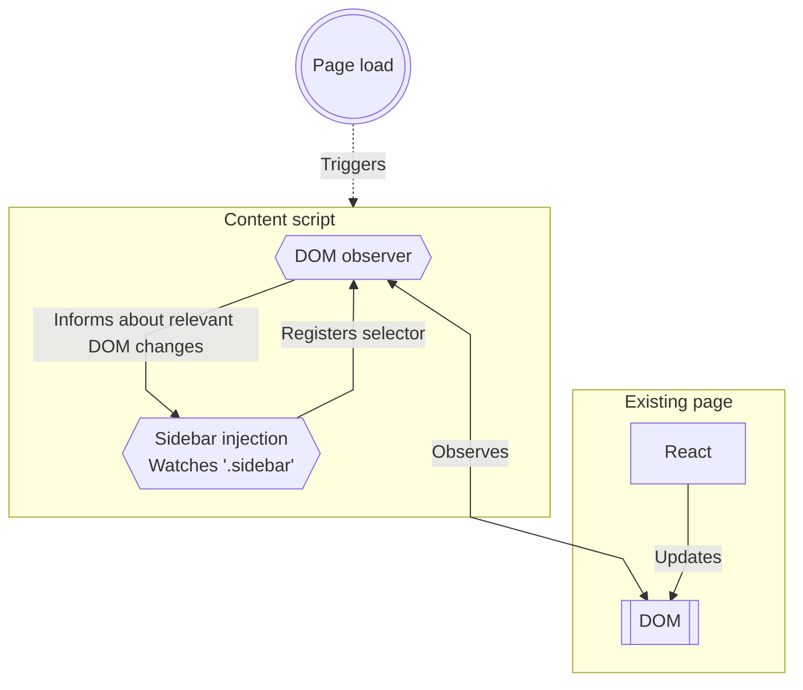

> :warning: This blog post is currently unfinished.

# Writing web extensions in an SPA-world

The world of frontend web development has in recent years transitioned largely to SPA development; frameworks like React, Angular and Vue, and the massive ecosystem of tools that surround them, make it attractive to write applications that update the DOM themselves instead of relying on the browser's built-in navigation.

This creates a challenge for web extensions that wish to modify the DOM in one way or another: how do you trigger your own DOM modifications, so the UI stays consistent, and your changes aren't removed when the underlying framework reconciles the DOM structure with its own internal structure?

An initial approach might be to hook into the underlying framework: if we can modify the frameworks internal structure instead of modifying the DOM, then our changes will survive framework changes; we would essentially be re-using the same source-of-truth as the framework. Unfortunately, most frameworks do not offer such hooks - and with the privacy provided by JS scoping, most also encapsulate their code in a way that is unreachable for us.

A different approach would be to observe the DOM, and re-apply our changes whenever an element we're interested in is updated. This requires some finessing to catch all changes, and risks introducing jank if we aren't careful, but generally works quite well. In this blog post I'll describe the framework I tend to use when writing page-modifying web extensions in an SPA-dominated world.

## The idea

When writing web extensions, we often want to modify specific parts of the DOM, so we can extend or replace functionality on the page. Traditionally this would be done by modifying the page whenever our script is injected - usually on page load - but this faces challenges when it comes to SPAs. Since they don't trigger page reloads, we must instead listen for DOM changes directly.

Through my work on web extensions I've found it useful to split the functionality up into reusable parts. My go-to architecture looks a little something like this:



## The injection instances

Each "injection" is a simple function that gets triggered whenever an element gets inserted or removed from the DOM, along with related information about which elements it is interested in. In particular, it is defined by the TypeScript type

```typescript
type InjectionConfig = {
  selector: string;                              // a selector matching any element we are interested in
  mount: ($elm: InjectedHTMLElement) => void;    // called when a relevant element is added to the DOM
  unmount?: ($elm: InjectedHTMLElement) => void; // called when a previously mounted element is removed from the DOM
};

// extend our notion of HTMLElements to keep track of which injections it is related to; this will be useful later
type InjectedHTMLElement = HTMLElement & {
  ___attached?: Set<InjectionConfig>;
};
```

This is a very flexible structure; by enforcing no opinions on what the injection does with the element it is interested in, we allow it to do a number of things. Do manual DOM modifications? Sure thing. Simple logging? I don't see why not. Inject your own React root, in case you want to develop your extensions UI in React? Easily implemented using a helper function:

```typescript
type InjectedReactElement = InjectedHTMLElement & { ___reactRoot?: ReturnType<typeof createRoot>; };

/** Utility function to ease the writing of React-based injections */
export function reactInjection(
  selector: string, // the element to inject into whenever it's added to the DOM
  // the React node to insert into our React root
  elm: React.ReactNode,
  // in case we don't want to inject our React root directly into the element,
  // this allows us to create an arbitrary container element first
  rootGenerator: ($elm: HTMLElement) => HTMLElement = $e => $e,
): InjectionConfig {
  return {
    selector,
    mount: ($elm: InjectedReactElement) => {
      const $container = rootGenerator($elm);
      const root = createRoot($container);
      Object.defineProperty($elm, "___reactRoot", {
        enumerable: false,
        value: root,
      });
      root.render(elm);
    },
    unmount: ($elm: InjectedReactElement) => {
      if (!$elm.___reactRoot) {
        return;
      }
      $elm.___reactRoot.unmount();
    },
  };
}
```

## The observer

The job of actually observing the DOM is also relatively simple: since each injection defines the selectors it is interested in, the only job of the observer is to keep track of elements as they are added and removed:

```typescript
const INJECTIONS: InjectionConfig[] = [/* ... */];
const MOUNTED: Set<InjectedHTMLElement> = new Set();

/** Reacts to element additions/removals, running relevant injections */
function onDOMChanges() {
  INJECTIONS.forEach((config) => {
    const { selector, mount } = config;
    const $elms = Array.from(
      document.querySelectorAll(selector)
    ) as InjectedHTMLElement[];
    $elms.forEach(($elm) => {
      if (!$elm) { return; }
      if (!$elm.___attached) {
        Object.defineProperty($elm, "___attached", {
          value: new Set([config]),
          enumerable: false,
        });
        mount($elm);
        MOUNTED.add($elm);
      } else if (!$elm.___attached.has(config)) {
        $elm.___attached.add(config);
        mount($elm);
      }
    });
  });

  MOUNTED.forEach(($elm: InjectedHTMLElement) => {
    if (!$elm.isConnected && $elm.___attached) {
      $elm.___attached.forEach(config => config.unmount?.($elm));
      MOUNTED.delete($elm);
      delete $elm.___attached;
    }
  });
}

/** Watches the DOM for elements being added and removed */
(function startWatching() {
  const observer = new MutationObserver(onDOMChanges);
  observer.observe(document.documentElement || document.body, {
    subtree: true,
    childList: true,
  });
  attach();
})();
```
